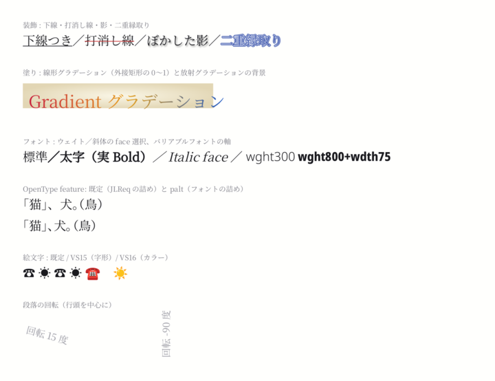
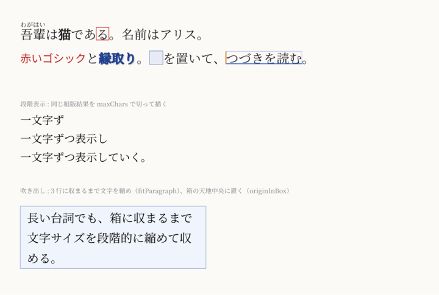
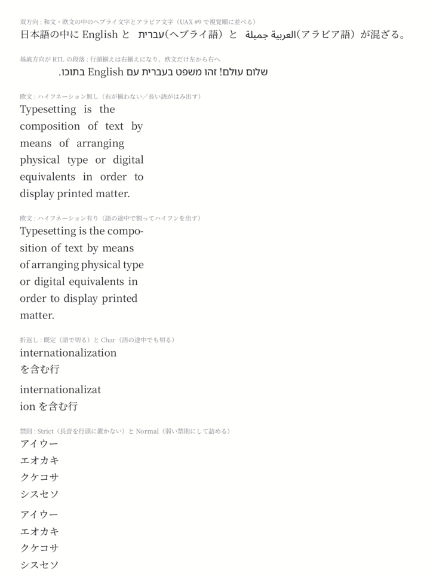

# サンプル

## Markdown と組版結果

同じ Markdown（`samples/markdown/report.md`）を横組み A4 と縦組み A5 で組んだものです。
見出しの採番と目次、脚注、箇条書き、コードブロック、表とキャプション、図、数式、ルビ、索引を 1 つの文書に入れています。

| | Markdown | PDF | 1 ページ目 |
|---|---|---|---|
| 横組み A4 | [report.md](https://github.com/wamsoft/jtypeset/blob/main/samples/markdown/report.md) | [report.pdf](samples/report.pdf) | [{ width=300 }](samples/report.pdf) |
| 縦組み A5 | 同じファイルを `--vertical --paper A5` で | [report_vertical.pdf](samples/report_vertical.pdf) | [{ width=220 }](samples/report_vertical.pdf) |

作り方（リポジトリルートで。フォントは `make fontdata` の Noto）:

```bash
make samples-md
# 中身は次の 2 行（2 ページ目以降の PNG は消す）
python -m jtypeset.md samples/markdown/report.md -o docs/samples/report.pdf --png 90
python -m jtypeset.md samples/markdown/report.md -o docs/samples/report_vertical.pdf --vertical --paper A5 --png 90
```

数式は既定で同梱の **MicroTeX**（LaTeX 数式）が組みます。MicroTeX 抜きでビルドしたときは front matter の
`math: {handler: mathtext}`（matplotlib が要る）に切り替えるか、代替テキストになります。

## C++ のサンプル

`samples/` にあります。すべて**リポジトリルートで実行**してください（`./data/` のフォントを読みます）。
`make fontdata && make prebuild && make build` のあと `make samples` でまとめて走らせられます。

| サンプル | 見せているもの | 出力 |
|---|---|---|
| `sample_dl` | 組版せずに表示リストを直接組み、3 つの出力先で座標が一致することを確かめる。グループの変形・不透明度、フェイクボールド／斜体、縁取り、平体 | `output_dl.*` |
| `sample_inline` | 同じ文を縦組みと横組みで組んで禁則・両端揃えを数値で検算。ルビ・縦中横・圏点・割注・字取り・ぶら下げ・カラー絵文字、Greedy と Knuth–Plass の比較 | `output_inline.*` |
| `sample_script` | 台本。A5 縦組み、名前欄付きのラベル段落、場見出しの改ページと巻き取り、柱・ノンブル、見開きの余白 | `output_script.*` |
| `sample_novel` | 小説。B6 縦組み 2 段、章見出しの段抜きと改ページ、ルビ（通常・熟語）、ぶら下げ、Knuth–Plass | `output_novel.*` |
| `sample_tech` | 技術文書。A4 横組み、図の回り込み、表（自動列幅・colspan / rowspan・ヘッダ繰り返し・ページまたぎ）、途中からの 2 段組と段抜き | `output_tech.*` |
| `sample_report` | レポート総合。目次、見出しの自動採番と PDF のしおり、図表番号と相互参照、脚注、索引、箇条書き、コードブロック、最終ページの段揃え | `output_report.*` |
| `sample_objects` | 外部オブジェクトの差し込み。関数ハンドラ・外部コマンド（`samples/handlers/plot.py`）・SVG の取り込み、式番号と相互参照 | `output_objects.*` |
| `sample_text_style` | 文字の装飾とフォント。下線・打消し線・影・二重縁取り・グラデーション、ウェイト／斜体の face 選択、バリアブルフォントの軸、`palt`、絵文字の表示形式、段落の回転、二値描画 | `output_text_style.*` |
| `sample_game` | ゲーム向け。タグ記法、リンクの矩形、ヒットテスト、キャレット、行内プレースホルダ、1 文字ずつの表示、吹き出しへの自動縮小 | `output_game.*` |
| `sample_intl` | 多言語と欧文の行分割。双方向テキスト、言語ごとのフォント、宣言による遅延ロード、ハイフネーション、折返しの方式、禁則の強弱 | `output_intl.*` |
| `handlers/microtex/sample_microtex` | MicroTeX による LaTeX 数式（任意ターゲット） | `output_microtex.*` |

それぞれ PNG（ページごと）・PDF（全ページ）・SVG（1 ページ目）を出します。

### 文字の装飾とフォント

[{ width=560 }](samples/sample_text_style.png)

### ゲーム向け（タグ記法と取り出し口）

赤・青・橙の細い枠は、リンクの範囲・ヒットテストで当たった文字・キャレットの位置を確認のために重ねて描いたものです。

[{ width=560 }](samples/sample_game.png)

### 多言語と欧文の行分割

[{ width=560 }](samples/sample_intl.png)

## Python のサンプル

`python/examples/` に `script.py`（台本）と `objects.py`（外部オブジェクト）があります。

```bash
PYTHONPATH=build/<preset>/python/Release python python/examples/script.py
```
