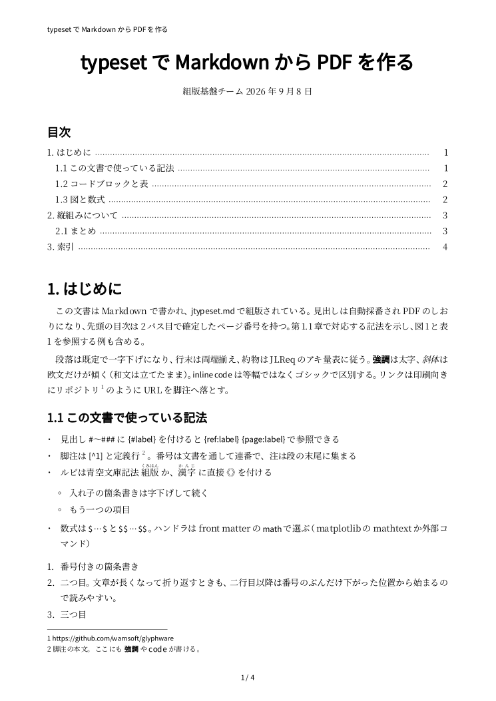
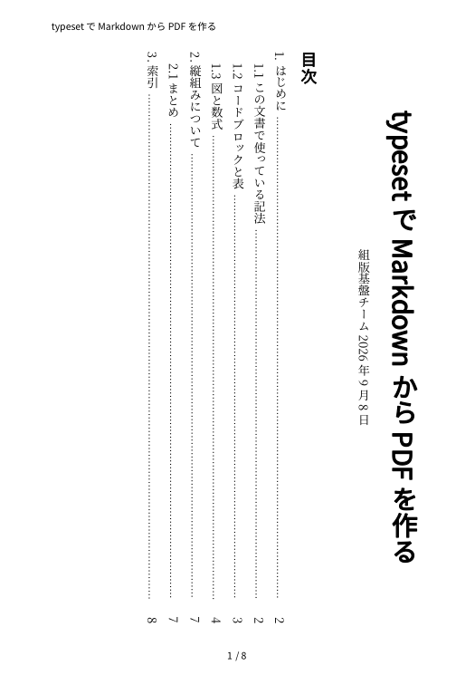

# サンプル: Markdown と組版結果

同じ Markdown（`samples/markdown/report.md`）を横組み A4 と縦組み A5 で組んだものです。
見出しの採番と目次、脚注、箇条書き、コードブロック、表とキャプション、図、数式、ルビ、索引を 1 つの文書に入れています。

| | Markdown | PDF | 1 ページ目 |
|---|---|---|---|
| 横組み A4 | [report.md](https://github.com/wamsoft/jtypeset/blob/main/samples/markdown/report.md) | [report.pdf](samples/report.pdf) | [{ width=300 }](samples/report.pdf) |
| 縦組み A5 | 同じファイルを `--vertical --paper A5` で | [report_vertical.pdf](samples/report_vertical.pdf) | [{ width=220 }](samples/report_vertical.pdf) |

作り方（リポジトリルートで。フォントは `make fontdata` の Noto）:

```bash
jtypeset-md samples/markdown/report.md -o docs/samples/report.pdf --png 90
jtypeset-md samples/markdown/report.md -o docs/samples/report_vertical.pdf --vertical --paper A5 --png 90
```

`make samples-md` でも同じものを再生成できます。数式は matplotlib の mathtext（`pip install matplotlib`）が入っていれば組まれ、
無ければ `[tex]` の代替テキストになります。
